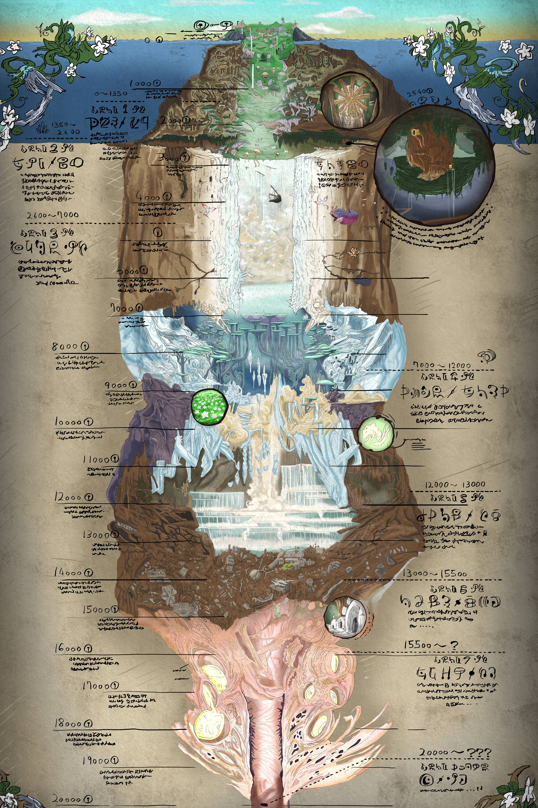

像素 : 单位宽度 = 1 : 3
## 奥斯岛 
- 高度 = 110 : 330
- 宽度 = 800 : 2400
- 世界高度 320，懒得调
- 生成距离按 5000 算
#### 大坑
- 宽度 333 : 1000
- 比例 1000 / 4500 = 0.2
#### 山峰
- 高度 140 : 420
- 宽度 500 : 1500
- 比例 1500 / 5000 = 0.3
#### 岛
- 比例 2400 / 4500 = 0.48
